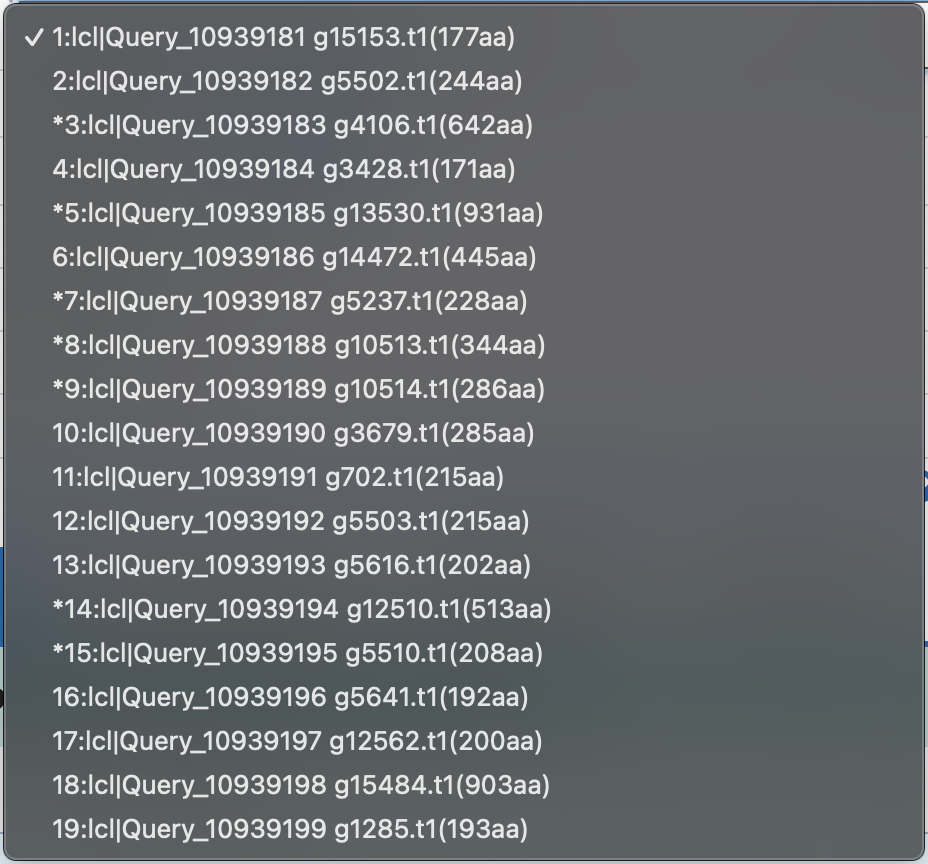

# Lab Report

## 1. Obtaining data. Genome sequence.

We get already assembled Ramazzottius varieornatus, the YOKOZUNA-1 strain genome 
```bash
wget ftp.ncbi.nlm.nih.gov/genomes/all/GCA/001/949/185/GCA_001949185.1_Rvar_4.0/GCA_001949185.1_Rvar_4.0_genomic.fna.gz
gunzip GCA_001949185.1_Rvar_4.0_genomic.fna.gz
```

## 2. Structural annotation.

```bash
wget --no-check-certificate \
 'https://drive.google.com/file/d/1hCEywBlqNzTrIpQsZTVuZk1S9qKzqQAq/view?usp=sharing' -O august_fasta
wget --no-check-certificate \
 'https://drive.google.com/file/d/12ShwrgLkvJIYQV2p1UlXklmxSOOxyxj4/view' -O august_gff
```
```bash
grep '>' augustus.whole.aa | wc -l
   16435
```

Всего: 16435

## 3. Physical localization 

Run script on fragments and data
```bash
python3.12 read_fasta.py
Write path to full proteins file: augustus.whole.aa
Write path to fragment file: peptides.fa
Write path to output file: results.fasta
Results have been saved to the file: results.fasta
```

## 4. Localization prediction

### 4a. WoLF PSORT
Load data on WoLF PSORT server

```
WoLF PSORT output: 
g15153.t1 details extr: 32
g5502.t1 details extr: 31, lyso: 1
g4106.t1 details E.R.: 14.5, E.R._golg: 9.5, extr: 7, golg: 3.5, lyso: 3, pero: 2, plas: 1, mito: 1
g3428.t1 details mito: 18, cyto: 11, extr: 2, nucl: 1
g13530.t1 details extr: 13, nucl: 6.5, lyso: 5, cyto_nucl: 4.5, plas: 3, E.R.: 3, cyto: 1.5
g14472.t1 details nucl: 28, plas: 2, cyto: 1, cysk: 1
g5237.t1 details plas: 24, mito: 8
g10513.t1 details nucl: 20, cyto_nucl: 14.5, cyto: 7, extr: 3, E.R.: 1, golg: 1
g10514.t1 details nucl: 19, cyto_nucl: 15, cyto: 9, extr: 3, mito: 1
g3679.t1 details extr: 26, mito: 2, lyso: 2, plas: 1, E.R.: 1
g702.t1 details extr: 29, plas: 2, lyso: 1
g5503.t1 details extr: 29, plas: 1, mito: 1, lyso: 1
g5616.t1 details extr: 31, mito: 1
g12510.t1 details plas: 29, cyto: 3
g5510.t1 details plas: 23, mito: 7, E.R.: 1, golg: 1
g5641.t1 details extr: 31, lyso: 1
g12562.t1 details extr: 30, lyso: 2
g15484.t1 details nucl: 17.5, cyto_nucl: 15.3333, cyto: 12, cyto_mito: 6.83333, plas: 1, golg: 1
g1285.t1 details extr: 25, plas: 5, mito: 1, lyso: 1
```

Extract nuclear proteins
```
g3428.t1 details mito: 18, cyto: 11, extr: 2, nucl: 1
g13530.t1 details extr: 13, nucl: 6.5, lyso: 5, cyto_nucl: 4.5, plas: 3, E.R.: 3, cyto: 1.5
g14472.t1 details nucl: 28, plas: 2, cyto: 1, cysk: 1
g10513.t1 details nucl: 20, cyto_nucl: 14.5, cyto: 7, extr: 3, E.R.: 1, golg: 1
g10514.t1 details nucl: 19, cyto_nucl: 15, cyto: 9, extr: 3, mito: 1
g15484.t1 details nucl: 17.5, cyto_nucl: 15.3333, cyto: 12, cyto_mito: 6.83333, plas: 1, golg: 1
```

### 4b. TargetP Server
Load data on TargetP server
```
# TargetP-2.0	Organism: Non-Plant	Timestamp: 20241225153128
# ID		Prediction	OTHER	SP	mTP	CS Position
g15153.t1	SP	        0.000014	0.999986	0.000000	CS pos: 16-17. AYA-AN. Pr: 0.8378
g5502.t1	SP	        0.001134	0.998823	0.000043	CS pos: 16-17. ASA-GS. Pr: 0.6833
g4106.t1	OTHER	    0.729658	0.266917	0.003425	
g3428.t1	OTHER	    0.999903	0.000033	0.000064	
g13530.t1	SP	        0.116007	0.883840	0.000153	CS pos: 19-20. TIP-FT. Pr: 0.3552
g14472.t1	OTHER	    0.999999	0.000001	0.000000	
g5237.t1	OTHER	    0.999545	0.000345	0.000111	
g10513.t1	OTHER	    0.999999	0.000001	0.000000	
g10514.t1	OTHER	    0.999543	0.000349	0.000107	
g3679.t1	SP	        0.001755	0.998023	0.000222	CS pos: 18-19. TFA-AR. Pr: 0.5523
g702.t1	    SP	        0.000347	0.999652	0.000001	CS pos: 16-17. ALA-AN. Pr: 0.8153
```

## 5. BLAST search

Choose 

<br>
<div style="display: flex; gap: 10px; align-items: center;">
    
</div>

Sign "*" in the beggining of empty output of search.

Next, parse file using script 
```bash
python3.12 parse_blast_output.py
Enter the path to the BLAST result file: data/PXRD4D97013-Alignment.txt
Enter the output CSV file path: data/PXRD4D97013-Alignment.txtbest_blast_matches.csv
Results saved to data/PXRD4D97013-Alignment.txtbest_blast_matches.csv
```

| Query               | Description                                        | Scientific Name    | Common Name | TaxID   | Max Score | Total Score | Query Cover | E-value | Percent Identity | Alignment Length | Accession |
|---------------------|----------------------------------------------------|--------------------|-------------|---------|-----------|-------------|-------------|---------|------------------|------------------|-----------|
| Query #1: g15153.t1 | U-scoloptoxin(01)-Er1a; Short=U-SLPTX(01)-Er1a;... | Ethmostigmus...       | NA          | 62613   | 68.9      | 68.9        | 46 %        | 2E-14   | 39.76           | 119              | P0DPW4.1  |
| Query #2: g5502.t1  | U-scoloptoxin(01)-Er1a; Short=U-SLPTX(01)-Er1a;... | Ethmostigmus...       | NA          | 62613   | 69.3      | 69.3        | 33 %        | 6E-14   | 39.76           | 119              | P0DPW4.1  |
| Query #3: g4106.t1  | No significant similarity found                    | NA                 | NA          | NA      | NA        | NA          | NA          | NA      | NA               | NA               | NA        |
| Query #4: g3428.t1  | Myosin regulatory light chain; AltName:...         | Caenorhabdit...       | NA          | 6239    | 199       | 199         | 91 %        | 9E-65   | 56.60           | 172              | Q09510.1  |
| Query #5: g13530.t1 | No significant similarity found                    | NA                 | NA          | NA      | NA        | NA          | NA          | NA      | NA               | NA               | NA        |
| Query #6: g14472.t1 | Damage suppressor protein [Ramazzottius...]        | Ramazzottius...       | NA          | 947166  | 814       | 814         | 100 %       | 0.0     | 100.00          | 445              | P0DOW4.1  |
| Query #7: g5237.t1  | No significant similarity found                    | NA                 | NA          | NA      | NA        | NA          | NA          | NA      | NA               | NA               | NA        |
| Query #8: g10513.t1 | No significant similarity found                    | NA                 | NA          | NA      | NA        | NA          | NA          | NA      | NA               | NA               | NA        |
| Query #9: g10514.t1 | No significant similarity found                    | NA                 | NA          | NA      | NA        | NA          | NA          | NA      | NA               | NA               | NA        |
| Query #10: g3679.t1 | Zinc metalloproteinase nas-14; AltName:...         | Caenorhabdit...       | NA          | 6239    | 98.2      | 98.2        | 72 %        | 7E-22   | 29.72           | 503              | Q19269.2  |
| Query #11: g702.t1  | U-scoloptoxin(01)-Er1a; Short=U-SLPTX(01)-Er1a;... | Ethmostigmus...       | NA          | 62613   | 62.4      | 62.4        | 39 %        | 1E-11   | 40.48           | 119              | P0DPW4.1  |
| Query #12: g5503.t1 | U-scoloptoxin(01)-Er1a; Short=U-SLPTX(01)-Er1a;... | Ethmostigmus...       | NA          | 62613   | 68.6      | 68.6        | 38 %        | 7E-14   | 39.76           | 119              | P0DPW4.1  |
| Query #13: g5616.t1 | U-scoloptoxin(01)-Er1a; Short=U-SLPTX(01)-Er1a;... | Ethmostigmus...       | NA          | 62613   | 69.7      | 69.7        | 40 %        | 2E-14   | 40.96           | 119              | P0DPW4.1  |
| Query #14: g12510.t1| No significant similarity found                    | NA                 | NA          | NA      | NA        | NA          | NA          | NA      | NA               | NA               | NA        |
| Query #15: g5510.t1 | No significant similarity found                    | NA                 | NA          | NA      | NA        | NA          | NA          | NA      | NA               | NA               | NA        |
| Query #16: g5641.t1 | U-scoloptoxin(01)-Er1a; Short=U-SLPTX(01)-Er1a;... | Ethmostigmus...       | NA          | 62613   | 65.9      | 65.9        | 43 %        | 5E-13   | 39.29           | 119              | P0DPW4.1  |
| Query #17: g12562.t1| U-scoloptoxin(01)-Er1a; Short=U-SLPTX(01)-Er1a;... | Ethmostigmus...       | NA          | 62613   | 65.5      | 65.5        | 41 %        | 7E-13   | 39.76           | 119              | P0DPW4.1  |
| Query #18: g15484.t1| Vacuolar protein sorting-associated protein 51...  | Danio rerio        | zebrafish   | 7955    | 592       | 592         | 78 %        | 0.0     | 45.03           | 827              | Q155U0.1  |
| Query #19: g1285.t1 | U-scoloptoxin(01)-Er1a; Short=U-SLPTX(01)-Er1a;... | Ethmostigmus...       | NA          | 62613   | 64.3      | 64.3        | 44 %        | 2E-12   | 37.21           | 119              | P0DPW4.1  |
## 6. Pfam prediction

| Protein    | Accession | Taxonomic Name               | E-value | % Ident | Query Cover | Annotation                                                                         |
|------------|-----------|------------------------------|---------|---------|-------------|-------------------------------------------------------------------------------------|
| g3428.t1   | Q09510.1  | Caenorhabditis elegans      | 9e-65   | 56.60%  | 91%         | Myosin regulatory light chain; Non-muscle myosin regulatory light chain; nmRLC     |
| g13530.t1  | —         | —                            | —       | —       | —           | —                                                                                   |
| g14472.t1  | P0DOW4.1  | Ramazzottius varieornatus   | 0.0     | 100.00% | 100%        | Damage suppressor protein                                                          |
| g10513.t1  | —         | —                            | —       | —       | —           | —                                                                                   |
| g10514.t1  | —         | —                            | —       | —       | —           | —                                                                                   |
| g15484.t1  | Q155U0.1  | Danio rerio                 | 0.0     | 45.03%  | 78%         | Vacuolar protein sorting-associated protein 51 homolog; Protein fat-free           |

## 7. Integrate various pieces of evidence

